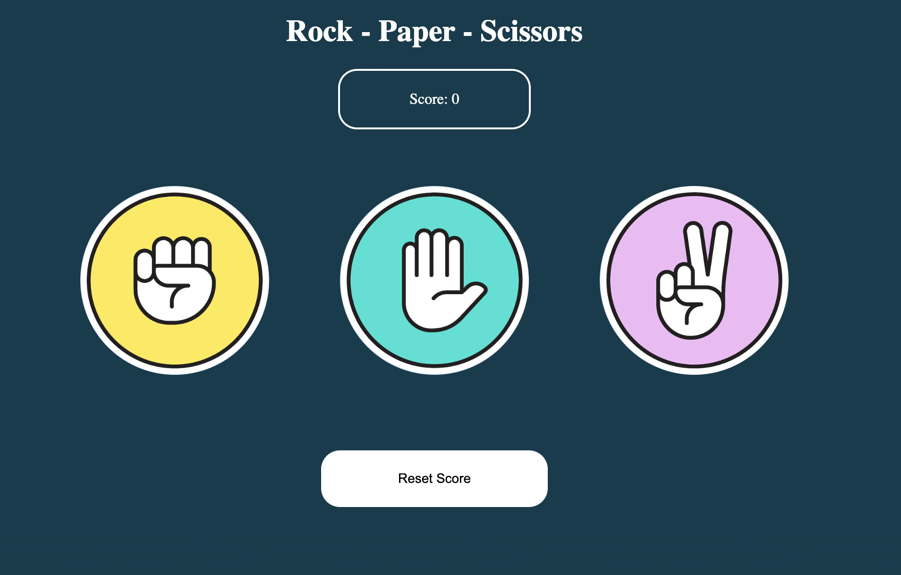
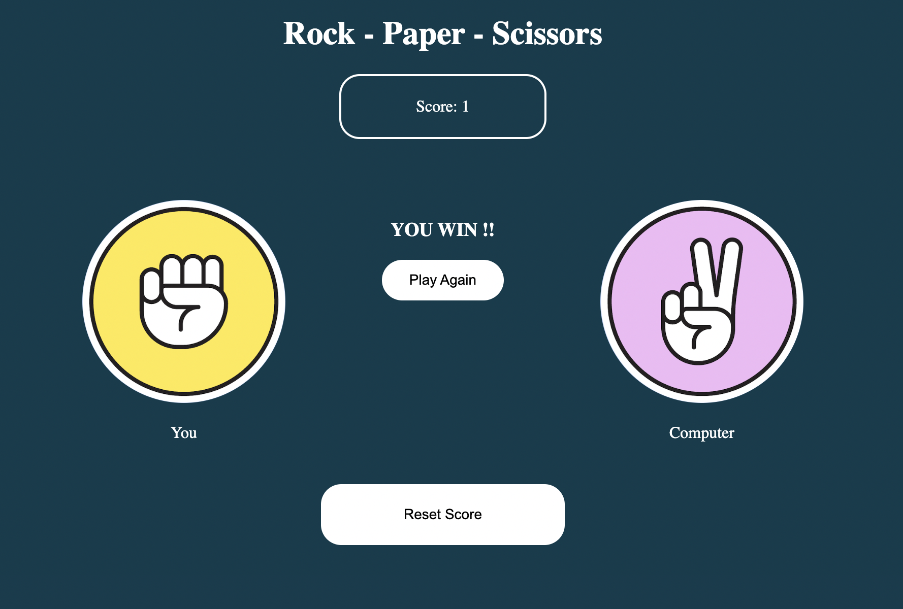

# Shifumi Game

This is custom solution for the classic Rock, Paper, Scissors game with some basic animations.

It has a live score system that is stored in the localstore so when you refresh the page, you can still have the actual score BUT if you're having some bad luck, you can always restart the score and keep trying to beat the computer!!

Here are some images from the actual game:

### Main View:

### Results View:

## Instructions to run locally:

1. Open a new terminal and run " git clone https://github.com/DRE97/shifumi-game.git "
2. cd shifumi-gam
3. npm install
4. npm start
5. Enjoy!